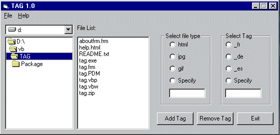



## Tag 1\.0

### Description

Tag 1.0 is a localisation tool.

I developed it while working in cbs.ie

It adds or removes localisation tags from the end of files.

E.G. test.html will be renamed to TEST_fr.html

It wouks on complete directories and any file type

You can use all this code - if you do please return the favour by voting for me thanks :)
 
### More Info
 
Direcroty with files

Renamed files

             |
---                |---
**Submitted On**   |2001-12-10 11:01:46
**By**             |[Kevin Egan](https://github.com/Planet-Source-Code/PSCIndex/blob/master/ByAuthor/kevin-egan.md)
**Level**          |Advanced
**User Rating**    |5.0 (10 globes from 2 users)
**Compatibility**  |VB 6\.0
**Category**       |[Complete Applications](https://github.com/Planet-Source-Code/PSCIndex/blob/master/ByCategory/complete-applications__1-27.md)
**World**          |[Visual Basic](https://github.com/Planet-Source-Code/PSCIndex/blob/master/ByWorld/visual-basic.md)
**Archive File**   |[Tag\_1\_0552362142002\.zip](https://github.com/Planet-Source-Code/kevin-egan-tag-1-0__1-31787/archive/master.zip)

